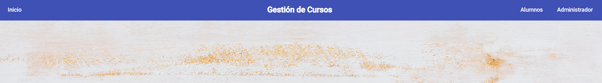
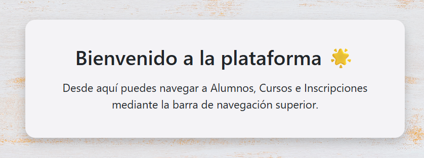
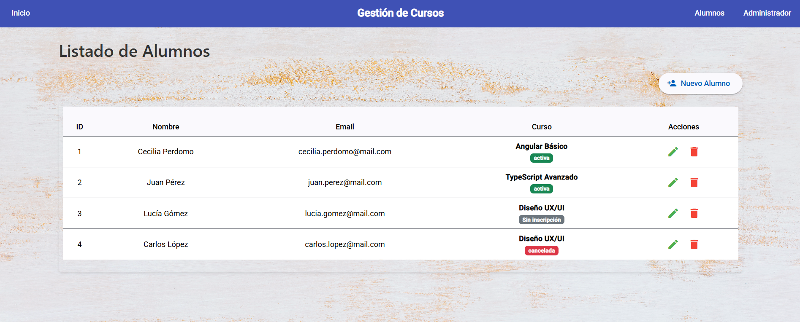
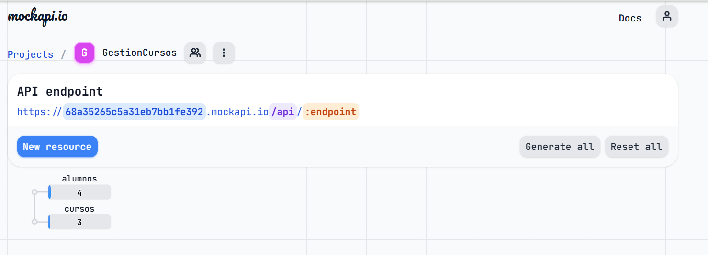

#  Tercera entrega Angular 
**Creación de un proyecto frontend basado en `Angular` para gestionar los asistentes a una serie de cursos.**

## 🖥️ Consigna
Creación de un proyecto frontend basado en `Angular` para gestionar los asistentes a una serie de cursos.

### Requisitos:
- Proyecto Angular publicado en GitHub.
- Menú lateral con las opciones de:
    - Alumnos
    - Cursos
    - Inscripciones
- Feature Modules:
    - Feature Module de Alumnos: Incluye componentes y servicios.
    - Feature Module de Cursos: Incluye componentes y servicios.
    - Feature Module de Inscripciones: Incluye componentes y servicios.
- Rutas: Implementación de rutas para acceder a cada uno de los feature modules.
- Operaciones de ABM (Altas, Bajas y Modificaciones) completas para cada opción, mostrando los datos utilizando el componente Table de Angular Material.

- El sistema deberá contener dos perfiles de usuario:
    - **Perfil Administrador**:
        - Podrá listar, realizar altas, bajas y modificaciones de los alumnos, cursos e inscripciones.
        - Tendrá la capacidad de crear y modificar usuarios.
    - **Perfil Usuario**:
        - Podrá listar los alumnos y los cursos.
        - Podrá agregar o eliminar inscripciones de alumnos a los cursos.
        - No podrá realizar ninguna operación sobre los usuarios.

## ​💻​ Proyecto
Este proyecto fue generado usando [Angular CLI](https://github.com/angular/angular-cli) version 20.0.5.

### ​​📑​ Recursos adicionales
Para obtener más información sobre cómo usar Angular CLI, incluyendo una referencia detallada de los comandos, visitá la página [Angular CLI Overview and Command Reference](https://angular.dev/tools/cli).

### 🎨 Angular Material
```bash
ng add @angular/material
```
**Documentación oficial**: https://material.angular.dev/guide/getting-started

### 🤡​ Animaciones
```bash
npm install @angular/animations@20.1.0 --legacy-peer-deps
```

## Gestión de cursos 
### Home page



- Menú **Alumnos**
    - Listado de alumnos 
    - Mis cursos
- Menú **Administrador**
    - Alumnnos
    - Cursos
    - Inscripciones



### 📦 Estructura de componentes
```bash
src/
├── app/
│   ├── app.ts                      # componente raíz
│   ├── app.routes.ts               # rutas principales
│
│   ├── layout/
│   │   ├── navbar/
│   │   │   └── navbar.ts / .html / .css
│   │   └── toolbar/
│   │       └── toolbar.ts /.html /.css
│
│   ├── pages/
│   │   ├── home /
│   │   │   └──  inicio.components.ts
│   │   ├── alumnos/
│   │   │   ├── lista-alumnos.ts / .html / .css
│   │   │   ├── alta-alumno.ts / html / .css
│   │   │   ├── mis-cursos.ts / .html / .css
│   │   │   ├── alumnos-routing.module.ts
│   │   │   └── alumnos.module.ts
│   │   │
│   │   ├── cursos/
│   │   │   ├── lista-cursos.ts / .html / .css
│   │   │   ├── alta-curso.ts /.html / .css
│   │   │   ├── cursos-routing.module.ts
│   │   │   └── cursos.module.ts
│   │   │
│   │   ├── inscripciones/
│   │   │   ├── listado-inscripciones.ts /.html /.css
│   │   │   ├── alta-inscripcion.ts / .html / .css
│   │   │   ├── inscripciones-routing.module.ts
│   │   │   └── inscripciones.module.ts
│
│   ├── services/
│   │   ├── alumno.service.ts
│   │   ├── curso.service.ts
│   │   └── inscripcion.service.ts
│
│   ├── models/
│   │   ├── alumno.model.ts
│   │   ├── curso.model.ts
│   │   └── inscripcion.model.ts
│
│   └── shared/
│       └── material.ts             # módulo compartido Angular Material

```

### 📦 Models y services
- **Models**: 
    - Interfaces o clases que definen la forma de los datos.
- **Services**:
    - Son clases que encapsulan lógica relacionada con datos.
    - Como no se utiliza base de datos aún, los services devuelven arrays simulados.

#### 🧑‍🎓 Modelo: Alumno

| **Campo**   | **Tipo**     | **Descripción**                        |
|---------|----------|------------------------------------|
| id      | number   | Identificador único del alumno     |
| nombre  | string   | Nombre completo del alumno         |
| email   | string   | Correo electrónico del alumno      |
| cursoId | number   | ID del curso al que está inscrito  |


#### 📘 Modelo: Curso

| **Campo**        | **Tipo**   | **Descripción**                                 |
|--------------|--------|---------------------------------------------|
| id           | number | Identificador único del curso               |
| nombre       | string | Nombre del curso                            |
| descripcion  | string | Detalle breve del contenido del curso       |
| fechaInicio  | Date   | Fecha de inicio del curso                   |
| duracion     | number | Duración del curso (en horas)        |


#### 📝 Modelo: Inscripción

| **Campo**             | **Tipo**                       | **Descripción**                                         |
|-------------------|----------------------------|-----------------------------------------------------|
| id                | number                     | Identificador único de la inscripción               |
| alumnoId          | number                     | ID del alumno inscrito                              |
| cursoId           | number                     | ID del curso al que se inscribe                     |
| fechaInscripcion  | Date                       | Fecha en la que se realizó la inscripción           |
| estado            | - activa <br> - cancelada <br> - finalizada <br> - sin inscripcion| Estado actual de la inscripción       |

## MockApi.io
- La opción sin costo permite dos recursos.
- https://github.com/mockapi-io/docs/wiki/Quick-start-guide



## 🛠️ Tecnologías utilizadas para el proyecto

| 🛠️ Tecnologías Utilizadas |
|----------------------------|
|          |


## ​​💣​ Servidor de desarrollo
- Para iniciar un servidor de desarrollo local, ejecutá: `ng s`
- Una vez que el servidor esté en funcionamiento, abrí tu navegador y navegá a `http://localhost:4200/`.
- La aplicación se recargará automáticamente cada vez que modifiques alguno de los archivos fuente.
- Para compilar el proyecto, ejecutá: `ng build`
- Puedes ver la versión en vivo en: `https://angular-3era-entrega.vercel.app/`

## 👩‍💻 Desarrollo
<p>Hecho con 💻, 🧉 y un toque de magia por <a href="https://www.linkedin.com/in/cecilia-perdomo/" style="color: black; text-decoration: none;">Cecilia Perdomo</a>.</p>
🗓️ Proyecto iniciado el <strong>16 de julio de 2025</strong>.

