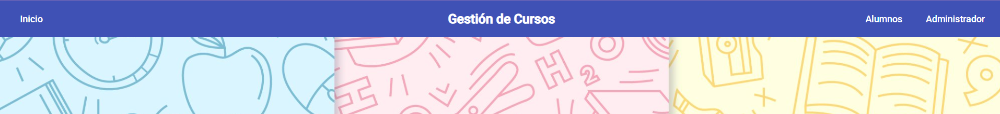

#  Primera Entrega Angular 
**Creación de un proyecto frontend basado en `Angular` para gestionar los asistentes a una serie de cursos.**

## 🖥️ Descripción General
El objetivo de esta entrega es desarrollar un proyecto frontend utilizando `Angular CLI` que permita la gestión de asistentes a diversos cursos. 

- El sistema debe contar con funcionalidades diferenciadas según el tipo de usuario: 
    - Administrador y Usuario. 
    - Cada uno tendrá acceso a diferentes secciones y funcionalidades específicas.

## 🔌​ Requisitos Generales
- Creación de un proyecto `Angular CLI`.
- Creación de componentes de layout, incluyendo un navbar para el menú lateral y un toolbar para el título de la aplicación.
- Componentes de la aplicación:
    - Lista de Alumnos: Visualización de los alumnos inscritos en los cursos.
    - ABM de Alumnos: Alta, Baja y Modificación de alumnos.
- Uso de Formularios Reactivos para la creación y modificación de alumnos.
- Estructuración de datos y lógica:
    - Implementar la representación de los datos en listas.
    - Tablas dinámicas con Angular Material, que tomen los datos desde arrays y funciones de TypeScript.

## ​👥​ Roles de usuario
- **Perfil Administrador**: El usuario con rol de administrador podrá realizar las siguientes acciones:
    - **Listar**: Consultar los listados de alumnos, cursos e inscripciones.
    - **Alta y baja**: Crear nuevos registros y eliminar alumnos, cursos e inscripciones.
    - **Modificación**: Modificar los datos de los alumnos, los cursos y las inscripciones.
    - **Gestión de usuarios**: Crear y modificar usuarios.
- **Perfil Usuario**: El usuario con rol de usuario tendrá las siguientes funcionalidades:
    - **Listar**: Consultar los listados de alumnos y cursos.
    - **Gestión de inscripciones**: Agregar o eliminar inscripciones de alumnos en los cursos.
    - **Restricciones**: No podrá modificar la información de los alumnos, los cursos ni los usuarios.

## ​💻​ Proyecto
Este proyecto fue generado usando [Angular CLI](https://github.com/angular/angular-cli) version 20.0.5.

### ​​📑​ Recursos adicionales
Para obtener más información sobre cómo usar Angular CLI, incluyendo una referencia detallada de los comandos, visitá la página [Angular CLI Overview and Command Reference](https://angular.dev/tools/cli).

### 🎨 Angular Material
```bash
ng add @angular/material
```
**Documentación oficial**: https://material.angular.dev/guide/getting-started

### 🤡​ Animaciones
```bash
npm install @angular/animations@20.1.0 --legacy-peer-deps
```

## Gestión de cursos 
### Home page



- Menú **Alumnos**
    - Listado de alumnos 
    - Mis cursos
- Menú **Administrador**
    - Alumnnos
    - Cursos
    - Inscripciones


### 📦 Estructura de componentes
```bash
src/
├── app/
│   ├── app.ts                      # componente raíz
│   ├── app.routes.ts               # rutas principales
│
│   ├── layout/
│   │   ├── navbar/
│   │   │   └── navbar.ts / .html / .css
│   │   └── toolbar/
│   │       └── toolbar.ts /.html /.css
│
│   ├── pages/
│   │   ├── alumnos/
│   │   │   ├── lista-alumnos.ts / .html / .css
│   │   │   ├── alta-alumno.ts / html / .css
│   │   │   └── mis-cursos.ts / .html / .css
│   │   │
│   │   ├── cursos/
│   │   │   ├── lista-cursos.ts / .html / .css
│   │   │   └── alta-curso.ts /.html / .css
│   │   │
│   │   ├── inscripciones/
│   │   │   ├── listado-inscripciones.ts /.html /.css
│   │   │   └── alta-inscripcion.ts / .html / .css
│
│   ├── services/
│   │   ├── alumno.service.ts
│   │   ├── curso.service.ts
│   │   └── inscripcion.service.ts
│
│   ├── models/
│   │   ├── alumno.model.ts
│   │   ├── curso.model.ts
│   │   └── inscripcion.model.ts
│
│   └── shared/
│       └── material.ts             # módulo compartido Angular Material

```

### 📦 Models:
- Interfaces o clases que definen la forma de los datos.

#### 🧑‍🎓 Modelo: Alumno

| Campo   | Tipo     | Descripción                        |
|---------|----------|------------------------------------|
| id      | number   | Identificador único del alumno     |
| nombre  | string   | Nombre completo del alumno         |
| email   | string   | Correo electrónico del alumno      |
| cursoId | number   | ID del curso al que está inscrito  |


#### 📘 Modelo: Curso

| Campo        | Tipo   | Descripción                                 |
|--------------|--------|---------------------------------------------|
| id           | number | Identificador único del curso               |
| nombre       | string | Nombre del curso                            |
| descripcion  | string | Detalle breve del contenido del curso       |
| fechaInicio  | Date   | Fecha de inicio del curso                   |
| duracion     | number | Duración del curso (en horas)        |


#### 📝 Modelo: Inscripción

| Campo             | Tipo                       | Descripción                                         |
|-------------------|----------------------------|-----------------------------------------------------|
| id                | number                     | Identificador único de la inscripción               |
| alumnoId          | number                     | ID del alumno inscrito                              |
| cursoId           | number                     | ID del curso al que se inscribe                     |
| fechaInscripcion  | Date                       | Fecha en la que se realizó la inscripción           |
| estado            | 'activa', 'cancelada', 'finalizada', 'sin inscripcion'| Estado actual de la inscripción       |


### 🛠 Services:
- Son clases que encapsulan lógica relacionada con datos.
- Como no se utiliza base de datos aún, los services devuelven arrays simulados.

## ​​💣​ Servidor de desarrollo
- Para iniciar un servidor de desarrollo local, ejecutá: `ng s`
- Una vez que el servidor esté en funcionamiento, abrí tu navegador y navegá a `http://localhost:4200/`.
- La aplicación se recargará automáticamente cada vez que modifiques alguno de los archivos fuente.
- Para compilar el proyecto, ejecutá: `ng build`
    - Puedes ver la versión en vivo en: angular-primera-entrega.vercel.app

## 👩‍💻 Desarrollo
<p>Hecho con 💻, 🧉 y un toque de magia por <a href="https://www.linkedin.com/in/cecilia-perdomo/" style="color: black; text-decoration: none;">Cecilia Perdomo</a>.</p>
🗓️ Proyecto iniciado el <strong>16 de julio de 2025</strong>.

