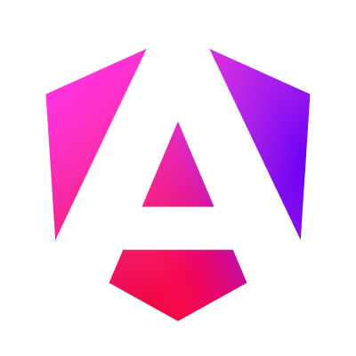
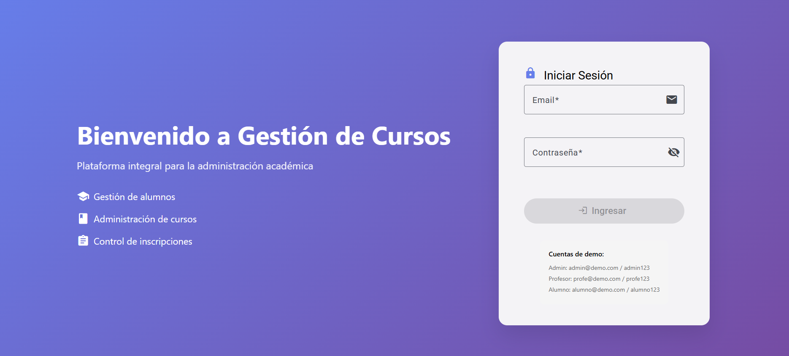
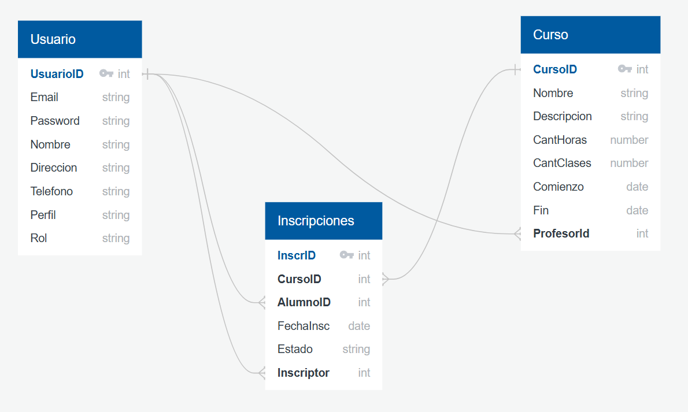
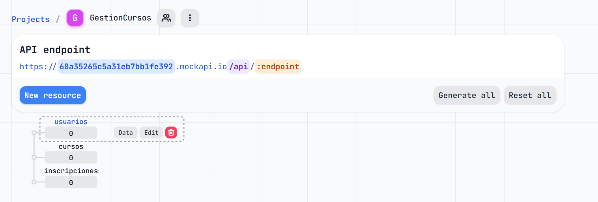
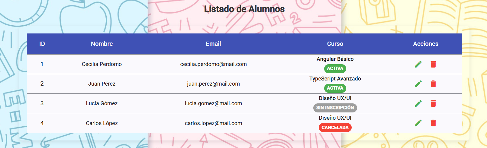

#  Gestión de cursos 
**Proyecto final**: 
- **Creación de un proyecto frontend basado en `Angular` para gestionar los asistentes a una serie de cursos.**

## 🖥️ Consigna
Creación de un proyecto frontend basado en `Angular` para gestionar los asistentes a una serie de cursos.

### **Objetivos**
- Dominar los conceptos iniciales, intermedios y avanzados para realizar un desarrollo basado en Angular y TypeScript.
- Comprender el concepto de componentes y servicios para su reutilización en otros proyectos.
-   Comprender el concepto de módulos, lazy loading, rutas y la organización del proyecto en módulos core, shared y feature.
- Integrar el patrón de estado global Redux y comprender la importancia de su uso utilizando la librería NgRx.
- Realizar test unitarios del proyecto frontend.

- El sistema deberá contener dos perfiles de usuario:
    - **Perfil Administrador**:
        - Podrá listar, realizar altas, bajas y modificaciones de los alumnos, cursos e inscripciones.
        - Tendrá la capacidad de crear y modificar usuarios.
    - **Perfil Usuario**:
        - Podrá listar los alumnos y los cursos.
        - Podrá agregar o eliminar inscripciones de alumnos a los cursos.
        - No podrá realizar ninguna operación sobre los usuarios.

### **Requisitos Base**
Los siguientes requisitos serán evaluados para aprobar el proyecto:

- **FrontEnd**:
    - Componente de Login:
        - El login se mostrará al inicio de la aplicación o cuando se intente acceder a cualquier ruta sin un usuario logueado.
    - Gestión de Perfiles:
        - Los administradores tendrán acceso a todas las opciones del menú.
        - Los usuarios comunes podrán listar alumnos y cursos, pero no tendrán acceso a la opción de "Usuarios".
    - Funcionalidad por Perfil:
        - El perfil usuario podrá listar los alumnos y cursos.
        - Los usuarios comunes podrán inscribir y desinscribir alumnos en los cursos.
- **Backend**:
    - Se podrá utilizar una cuenta en mockapi.io (u otra alternativa) para gestionar los recursos:
        - Usuarios: Contienen los campos de email, password, nombre, dirección, teléfono y perfil.
        - Alumnos: Contienen los campos de nombre y perfil (desarrollador, IT, usuario final, etc.).
        - Curso: Contienen los campos de nombre, cantidad de horas, cantidad de clases y nombre del profesor asignado.
        - Inscripciones: Contienen el ID del alumno, ID del curso inscrito, fecha de inscripción y el ID del usuario que realizó la inscripción.

> **Nota**: Este proyecto está basado en un sistema donde un usuario administrador es el encargado de registrar a los demás usuarios. Además, se incluyen cuentas demo con el fin de probar funcionalidades específicas y facilitar el testeo del proyecto.

## ​💻​ Proyecto
Este proyecto fue generado usando [Angular CLI](https://github.com/angular/angular-cli) version 20.0.5.

## ​​📑​ Recursos adicionales
Para obtener más información sobre cómo usar Angular CLI, incluyendo una referencia detallada de los comandos, visitá la página [Angular CLI Overview and Command Reference](https://angular.dev/tools/cli).

## Instalaciones 
### 🎨 Angular Material
```bash
ng add @angular/material
```
**Documentación oficial**: https://material.angular.dev/guide/getting-started

### 🤡​ Animaciones
```bash
npm install @angular/animations@20.1.0 --legacy-peer-deps
```

### Redux
```bash
npm install @ngrx/store @ngrx/effects @ngrx/store-devtools
```

## Gestión de cursos 


> Luego de iniciar sesión, según el rol de cada usuario, el sistema te re-direccionará al dashboard que corresponde. 

### 📦 Modelo


> **Nota**: Para el curso solo armé tres tablas: `usuario`, `curso` e `inscripciones`. Igual, pensando en que el sistema pueda crecer, habría sido mejor sumar otras dos tablas: `perfil` y `rol`, así sería más fácil agregar nuevos perfiles o roles (Administrador, Profesor y Alumno) para darle más escabilidad al proyecto. 

## MockApi.io
- **MockAPI** es un servicio online que te permite crear APIs falsas (mock APIs) de manera rápida y sencilla.
- https://github.com/mockapi-io/docs/wiki/Quick-start-guide



---  

| 🛠️ **Tecnologías utilizadas para el proyecto**  |
|----------------------------|
|               |


## ​​💣​ Servidor de desarrollo
- Para iniciar un servidor de desarrollo local, ejecutá: `ng s`
- Una vez que el servidor esté en funcionamiento, abrí tu navegador y navegá a `http://localhost:4200/`.
- La aplicación se recargará automáticamente cada vez que modifiques alguno de los archivos fuente.
- Para compilar el proyecto, ejecutá: `ng build`
- Puedes ver la versión en vivo en: `https://proyecto-final-gestion-cursos.vercel.app/`

## Jasmine & Karma test



## 👩‍💻 Desarrollo
<p>Hecho con 💻, 🧉 y un toque de magia por <a href="https://www.linkedin.com/in/cecilia-perdomo/" style="color: black; text-decoration: none;">Cecilia Perdomo</a>.</p>
🗓️ Proyecto iniciado el <strong>16 de julio de 2025</strong>.

